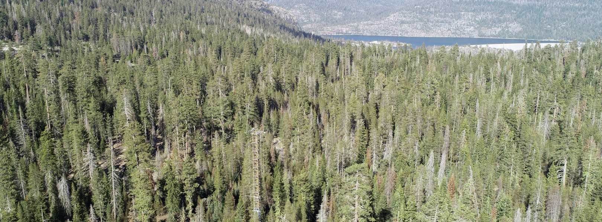

\

# **Bio 476 - Final Research Project**
<p style="font-size:20pt; color:black">Lower Teakettle --- Chloroflexota</p>

<!-- library(usethis) -->
<!-- use_git_config(user.name = "tgrodrigues13", user.email = "tgrodrigues@umass.edu") -->
<!-- <p style="font-size:16pt; color:black">MESSAGE</p> -->

```{r, eval=F, echo=F}
#'[Loading in Libraries]

if (!require("BiocManager", quietly=TRUE))
    install.packages("BiocManager")

BiocManager::install("treeio")
BiocManager::install("ggtreeExtra")
```
```{r, echo=F}
suppressPackageStartupMessages(library(tidyverse))
suppressPackageStartupMessages(library(knitr))
suppressPackageStartupMessages(library(ggtree))
suppressPackageStartupMessages(library(TDbook))
suppressPackageStartupMessages(library(ggimage))
suppressPackageStartupMessages(library(rphylopic))
suppressPackageStartupMessages(library(treeio))
suppressPackageStartupMessages(library(tidytree))
suppressPackageStartupMessages(library(ape))
suppressPackageStartupMessages(library(TreeTools))
suppressPackageStartupMessages(library(phytools))
suppressPackageStartupMessages(library(ggnewscale))
suppressPackageStartupMessages(library(ggtreeExtra))
suppressPackageStartupMessages(library(ggstar))
suppressPackageStartupMessages(library(plotly))
suppressPackageStartupMessages(library(zoo))
```

# Abstract
<!-- Short like 5 sentences -->
In this NEON project...

\

# Motivating Reasons
<!-- Probably 1 paragraph -->
This project is important...

\

# Introduction
<!-- Probably 2 paragraphs -->
The National Science Foundation's National Ecological Observatory Network (NEON) is a country wide program operated by Battelle and is set up to collect long term ecological data. This is an open access data base with the goal of better understanding how nature and the ecosystems are constantly changing. In our specific project we aim to focus in on one of these NEON sites as well as a specific phylum. We will take a deep dive into phylogenies, metagenome-assembled (MAG) data, metagenomic data and chemistry data to gain a deeper understanding of these species and their ecosystems. We specifically will look in on the Lower Teakettle region located at Sierra National Forest in California, USA as well as the Chloroflexota phylum. 

\

{width=300px, height=400px}

\

The Lower Teakettle NEON site is an evergreen forest biome 

# Methods
```{r, message=F, warning=F}
#'[MAG Data]

NEON_MAGs <- read_csv("data/GOLD_Study_ID_Gs0161344_NEON_2024_4_21.csv") %>% 
#remove columns that are not needed for data analysis
  select(-c(`GOLD Study ID`, `Bin Methods`, `Created By`, `Date Added`, `Bin Lineage`)) %>% 
#create a new column with the Assembly Type
  mutate("Assembly Type" = case_when(`Genome Name` == "NEON combined assembly" ~ `Genome Name`, TRUE ~ "Individual")) %>% 
  mutate_at("Assembly Type", str_replace, "NEON combined assembly", "Combined") %>% 
  mutate_at("GTDB-Tk Taxonomy Lineage", str_replace, "d__", "") %>%  
  mutate_at("GTDB-Tk Taxonomy Lineage", str_replace, "p__", "") %>% 
  mutate_at("GTDB-Tk Taxonomy Lineage", str_replace, "c__", "") %>% 
  mutate_at("GTDB-Tk Taxonomy Lineage", str_replace, "o__", "") %>% 
  mutate_at("GTDB-Tk Taxonomy Lineage", str_replace, "f__", "") %>% 
  mutate_at("GTDB-Tk Taxonomy Lineage", str_replace, "g__", "") %>% 
  mutate_at("GTDB-Tk Taxonomy Lineage", str_replace, "s__", "") %>%
  separate(`GTDB-Tk Taxonomy Lineage`, c("Domain", "Phylum", "Class", "Order", "Family", "Genus", "Species"), ";", remove=FALSE) %>%
  mutate_at("Domain", na_if,"") %>% 
  mutate_at("Phylum", na_if,"") %>% 
  mutate_at("Class", na_if,"") %>% 
  mutate_at("Order", na_if,"") %>% 
  mutate_at("Family", na_if,"") %>% 
  mutate_at("Genus", na_if,"") %>% 
  mutate_at("Species", na_if,"") %>% 
#Get rid of the the common string "Soil microbial communities from "
  mutate_at("Genome Name", str_replace, "Terrestrial soil microbial communities from ", "") %>% 
#Use the first `-` to split the column in two
  separate(`Genome Name`, c("Site","Sample Name"), " - ") %>% 
#Get rid of the the common string "S-comp-1"
  mutate_at("Sample Name", str_replace, "-comp-1", "") %>%
#separate the Sample Name into Site ID and plot info
  separate(`Sample Name`, c("Site ID","subplot.layer.date"), "_", remove = FALSE,) %>% 
#separate the plot info into 3 columns
  separate(`subplot.layer.date`, c("Subplot", "Layer", "Date"), "-")
```
```{r, message=F, warning=F}
#'[Metagenome Data]

NEON_metagenomes <- read_tsv("data/exported_img_data_Gs0161344_NEON.tsv") %>% 
  select(-c(`Domain`, `Sequencing Status`, `Sequencing Center`)) %>% 
  rename(`Genome Name` = `Genome Name / Sample Name`) %>% 
  filter(str_detect(`Genome Name`, 're-annotation', negate = T)) %>% 
  filter(str_detect(`Genome Name`, 'WREF plot', negate = T))

#'[Reformatting Genome Name]

NEON_metagenomes <- NEON_metagenomes %>% 
#Get rid of the the common string "Soil microbial communities from "
  mutate_at("Genome Name", str_replace, "Terrestrial soil microbial communities from ", "") %>% 
#Use the first `-` to split the column in two
  separate(`Genome Name`, c("Site","Sample Name"), " - ") %>% 
#Get rid of the the common string "-comp-1"
  mutate_at("Sample Name", str_replace, "-comp-1", "") %>%
#separate the Sample Name into Site ID and plot info
  separate(`Sample Name`, c("Site ID","subplot.layer.date"), "_", remove = FALSE,) %>% 
#separate the plot info into 3 columns
  separate(`subplot.layer.date`, c("Subplot", "Layer", "Date"), "-")
```
```{r, message=F}
#'[Chemistry Data]

NEON_chemistry <- read_tsv("data/neon_plot_soilChem1_metadata.tsv") %>% 
#remove -COMP from genomicsSampleID
  mutate_at("genomicsSampleID", str_replace, "-COMP", "")
```
```{r}
#'[Joining MAG, Metagenome, and Chemistry into a Single Dataframe]

NEON_combo <- NEON_MAGs %>% 
  left_join(NEON_metagenomes, by = "Sample Name") %>% 
  left_join(NEON_chemistry, by = c("Sample Name" = "genomicsSampleID")) %>% 
  rename("label" = "Bin ID")
```
```{r, echo=F}
#'[Filter Combo Data to Taxonomic Group or Site]

NEON_combo_Chloroflexota <- NEON_combo %>% 
  filter(Phylum == "Chloroflexota")

NEON_combo_TEAK <- NEON_combo %>% 
  filter(`Site ID.x` == "TEAK") %>% 
  filter(Domain == "Bacteria")
```
```{r, warning=F, message=F}
#'[Loading in Sankey NEON Data]

NEON_MAGs_Sankey <- read_csv("data/GOLD_Study_ID_Gs0161344_NEON_edArchaea.csv") %>%
#remove columns that are not needed for data analysis
  select(-c(`GOLD Study ID`, `Bin Methods`, `Created By`, `Date Added`)) %>%
#create a new column with the Assembly Type
  mutate("Assembly Type" = case_when(`Genome Name` == "NEON combined assembly" ~ `Genome Name`, TRUE ~ "Individual")) %>%
  mutate_at("Assembly Type", str_replace, "NEON combined assembly", "Combined") %>%
  separate(`GTDB-Tk Taxonomy Lineage`, c("Domain", "Phylum", "Class", "Order", "Family", "Genus"), "; ", remove = FALSE) %>%
#Get rid of the the common string "Soil microbial communities from "
  mutate_at("Genome Name", str_replace, "Terrestrial soil microbial communities from ", "") %>%
#Use the first `-` to split the column in two
  separate(`Genome Name`, c("Site","Sample Name"), " - ") %>%
#Get rid of the the common string "S-comp-1"
  mutate_at("Sample Name", str_replace, "-comp-1", "") %>%
#separate the Sample Name into Site ID and plot info
  separate(`Sample Name`, c("Site ID","subplot.layer.date"), "_", remove = FALSE,) %>%
#separate the plot info into 3 columns
  separate(`subplot.layer.date`, c("Subplot", "Layer", "Date"), "-")
```

<!-- Small description of how we got data/interpreted it -->

<!-- Talk about https://www.neonscience.org/field-sites/about-field-sites and 'creation' of phylum with 50s rRNA-->

# Results

### Site Graphs - Lower Teakettle, Sierra National Forest, California, USA

<!-- Circle Phylogeny for TEAK With Colored Phylum Labels -->

```{r, echo=F}
#'[Reading in Tree Files from GTDB]

#tree_arc <- read.tree("data/gtdbtk.ar53.decorated.tree")
tree_bac <- read.tree("data/gtdbtk.bac120.decorated.tree")
```
```{r, results=F, echo=F}
#'[Getting Your Subtree]

#Make a vector with the internal node labels
node_vector_bac = c(tree_bac$tip.label,tree_bac$node.label)

#Search for your Phylum or Class to get the node
grep("Chloroflexota", node_vector_bac, value = TRUE)
```
```{r, results=F, echo=F}
match(grep("Chloroflexota", node_vector_bac, value = TRUE), node_vector_bac)
```
```{r, echo=F}
#'[Need to Preorder Tree Before Extracting]

tree_bac_preorder <- Preorder(tree_bac)
tree_Chloroflexota <- Subtree(tree_bac_preorder, 1712)
```
```{r, fig.width = 10, fig.height = 8, fig.align = 'center'}
#'[Graph Chunk]

TEAK_MAGs_label <- NEON_combo_TEAK$label

tree_bac_TEAK_MAGs <-drop.tip(tree_bac,tree_bac$tip.label[-match(TEAK_MAGs_label, tree_bac$tip.label)])

ggtree(tree_bac_TEAK_MAGs, layout="circular") %<+%
  NEON_combo +
  geom_point(mapping=aes(fill=Phylum), size = 2.5, shape = 23) +
  ggtitle("Different Phylums Located at Lower Teakettle") +
  theme(plot.title = element_text(hjust = 0.5),(size = 30)) #face = "bold"
```
This phylogeny circle shows the different species located at the Lower Teakettle Site. It is always important for scientists to know what organisms we are working with, and there is no better way than a phylogeny to show that. The phylogeny is color coded by phylum. Note that a solution to the grey 'NA' nodes was never found. 

<!-- MAGs at Our Site Colored by Phylum -->

```{r, results = "hold", fig.width = 8, fig.height = 4}
#'[Table and Graph Chunk]

NEON_MAGs_Site <- NEON_MAGs %>% 
  filter(Domain == "Bacteria") %>% 
  filter(`Site ID` == "TEAK") %>% 
  select(c(`Site ID`, `Domain`, `Phylum`, `Class`, `Order`, `Family`, `Genus`))

kable(NEON_MAGs_Site)

NEON_MAGs_Site %>% 
  ggplot(aes(x = fct_rev(fct_infreq(`Site ID`)), fill = Phylum)) +
  geom_bar(position = position_dodge2(width = 0.8, preserve = "single")) +
  labs(title = "MAG Counts at Lower Teakettle", x = "Site ID", y = "MAG Count")
```
This bar plot shows...

<!-- Scatter for TEAK showing 16s RNA Count -->

```{r, fig.width = 10, fig.height = 6, fig.align = 'center'}
NEON_combo_TEAK %>% 
  ggplot(aes(x=`Total Number of Bases`, y = `Bin Completeness`, color = `16s rRNA`)) +
  geom_point() +
  theme(axis.text.x = element_text(color = "black", angle = 40, hjust = 1, vjust = 1, size = 10)) +
  labs(title = "Total Number of Bases vs Bin Completeness at Lower Teakettle Site", x = "Total Number of Bases", y = "Bin Completeness (%)", color = "Number of 16s rRNA")
```

This scatter plot shows data from the Lower Teakettle site and compares total number of bases to bin completion. The number of 16s RNA per organism is also highlighted. 16s RNA is an important metric as it is what allows scientists to differentiate between organisms at the genus level. Across all the major phyla of bacteria, 16s RNA has been helping scientists become more precise when developing phylogenies and studying relationships between these organisms. 

\

### Phylum Graphs - Chloroflexota

<!-- Sankey Plot of Individual Assembly at TEAK -->
<!-- Talk about what a Sankey Plot is? -->

```{r, warning=F}
#'[Sorting for Phylum - Individual Assembly]

NEON_MAGs_Ind_Sankey <- NEON_MAGs_Sankey %>%
  filter(`Assembly Type` == "Individual")

NEON_MAGs_Ind_Chloro_Sankey <- NEON_MAGs_Ind_Sankey %>%
  filter(Phylum == "Chloroflexota")

#Select the GTDB Taxonomic lineage and separate into taxonomic levels
sankey_data <- NEON_MAGs_Ind_Chloro_Sankey %>%
  select(`GTDB-Tk Taxonomy Lineage`) %>%
#NAs are likely Archaea
  replace_na(list(`GTDB-Tk Taxonomy Lineage` = 'Archaea')) %>%
#Pavian format requires p__ etc
  separate(`GTDB-Tk Taxonomy Lineage`, c("Domain", "Phylum", "Class", "Order", "Family", "Genus", "Species"), "; ")

#Fill in the NAs with the taxonomic the higher taxonomic level to the left
sankey_data[] <- t(apply(sankey_data, 1, zoo::na.locf))

#Put the data into a format that can be read by the Sankey App
sankey_data <- sankey_data %>%
  unite(col = "classification", c(Domain, Phylum, Class, Order, Family, Genus, Species), sep='; ') %>%
  mutate_at("classification", str_replace, "Archaea", "d__Archaea") %>%
  mutate_at("classification", str_replace, "Bacteria", "d__Bacteria") %>%  
  mutate_at("classification", str_replace, "; ", "|p__") %>%
  mutate_at("classification", str_replace, "; ", "|c__") %>%
  mutate_at("classification", str_replace, "; ", "|o__") %>%
  mutate_at("classification", str_replace, "; ", "|f__") %>%
  mutate_at("classification", str_replace, "; ", "|g__") %>%
  mutate_at("classification", str_replace, "; ", "|s__")  

#Create format for Pavian with counts for each taxonomic level
sankey_data_s <- sankey_data
sankey_data_g <- sankey_data
sankey_data_f <- sankey_data
sankey_data_o <- sankey_data
sankey_data_c <- sankey_data
sankey_data_p <- sankey_data
sankey_data_d <- sankey_data

sankey_data_g$classification <- sub("\\|s__.*", "", sankey_data_g$classification)  
sankey_data_f$classification <- sub("\\|g__.*", "", sankey_data_f$classification)  
sankey_data_o$classification <- sub("\\|f__.*", "", sankey_data_o$classification)  
sankey_data_c$classification <- sub("\\|o__.*", "", sankey_data_c$classification)  
sankey_data_p$classification <- sub("\\|c__.*", "", sankey_data_p$classification)  
sankey_data_d$classification <- sub("\\|p__.*", "", sankey_data_d$classification)  

sankey_data_allTaxa <- bind_rows(sankey_data_s, sankey_data_g, sankey_data_f, sankey_data_o, sankey_data_c, sankey_data_p, sankey_data_d) %>%
  mutate(classification = as.factor(classification)) %>%
  count(classification) %>%
#rename for Pavian format
  rename(`#SampleID` = `classification`) %>%
  rename(`Metaphlan2_Analysis` = `n`)

#Write file to input to Pavian Sankey
write_tsv(sankey_data_allTaxa, "Ind_Chloro.txt")
```
```{r}
knitr::include_url("sankey-Ind_Chloro.txt.html")
```
This Sankey plot shows the taxononomy lineage of our phylum, Chloroflexota. It visualizes the taxonomic lineage data from NEON MAGs, formats it for a Sankey diagram, and saves it in a suitable format for use with the Pavian tool, which can visualize metagenomic classifications. Metagenomics provides genetic insights into potentially novel biocatalysts and enzymes, establishes genomic connections between function and phylogeny in uncultured organisms, and offers evolutionary profiles of community function and structure.

<!-- Sankey Plot of Combined Assembly at TEAK -->
<!-- Talk about what a Sankey Plot is? -->

```{r, warning=F}
#'[Sorting for Phylum - Combined Assembly]

NEON_MAGs_Co_Sankey <- NEON_MAGs_Sankey %>%
  filter(`Assembly Type` == "Combined")

NEON_MAGs_Co_Chloro_Sankey <- NEON_MAGs_Co_Sankey %>%
  filter(Phylum == "Chloroflexota")

#Select the GTDB Taxonomic lineage and separate into taxonomic levels
sankey_data <- NEON_MAGs_Co_Chloro_Sankey %>%
  select(`GTDB-Tk Taxonomy Lineage`) %>%
#NAs are likely Archaea
  replace_na(list(`GTDB-Tk Taxonomy Lineage` = 'Archaea')) %>%
#Pavian format requires p__ etc
  separate(`GTDB-Tk Taxonomy Lineage`, c("Domain", "Phylum", "Class", "Order", "Family", "Genus", "Species"), "; ")

#Fill in the NAs with the taxonomic the higher taxonomic level to the left
sankey_data[] <- t(apply(sankey_data, 1, zoo::na.locf))

#Put the data into a format that can be read by the Sankey App
sankey_data <- sankey_data %>%
  unite(col = "classification", c(Domain, Phylum, Class, Order, Family, Genus, Species), sep='; ') %>%
  mutate_at("classification", str_replace, "Archaea", "d__Archaea") %>%
  mutate_at("classification", str_replace, "Bacteria", "d__Bacteria") %>%  
  mutate_at("classification", str_replace, "; ", "|p__") %>%
  mutate_at("classification", str_replace, "; ", "|c__") %>%
  mutate_at("classification", str_replace, "; ", "|o__") %>%
  mutate_at("classification", str_replace, "; ", "|f__") %>%
  mutate_at("classification", str_replace, "; ", "|g__") %>%
  mutate_at("classification", str_replace, "; ", "|s__")  

#Create format for Pavian with counts for each taxonomic level
sankey_data_s <- sankey_data
sankey_data_g <- sankey_data
sankey_data_f <- sankey_data
sankey_data_o <- sankey_data
sankey_data_c <- sankey_data
sankey_data_p <- sankey_data
sankey_data_d <- sankey_data

sankey_data_g$classification <- sub("\\|s__.*", "", sankey_data_g$classification)  
sankey_data_f$classification <- sub("\\|g__.*", "", sankey_data_f$classification)  
sankey_data_o$classification <- sub("\\|f__.*", "", sankey_data_o$classification)  
sankey_data_c$classification <- sub("\\|o__.*", "", sankey_data_c$classification)  
sankey_data_p$classification <- sub("\\|c__.*", "", sankey_data_p$classification)  
sankey_data_d$classification <- sub("\\|p__.*", "", sankey_data_d$classification)  

sankey_data_allTaxa <- bind_rows(sankey_data_s, sankey_data_g, sankey_data_f, sankey_data_o, sankey_data_c, sankey_data_p, sankey_data_d) %>%
  mutate(classification = as.factor(classification)) %>%
  count(classification) %>%
#rename for Pavian format
  rename(`#SampleID` = `classification`) %>%
  rename(`Metaphlan2_Analysis` = `n`)

#Write file to input to Pavian Sankey
write_tsv(sankey_data_allTaxa, "Co_Chloro_pavian.txt")
```
```{r}
knitr::include_url("sankey-Co_Chloro_pavian.txt.html")
```
This Sankey plot visualizes the taxonomic lineage of the phylum Chloroflexota, based on combined assembly data. The provided code filters and prepares taxonomic lineage data from NEON MAGs, formats it for a Sankey diagram, and saves it in a format suitable for the Pavian tool, which is used to visualize metagenomic classifications. The distinction between individual and combined assemblies is crucial for researchers. Individual assemblies focus on specific samples, providing detailed insights into the genetic makeup and functions within a single dataset. In contrast, combined assemblies aggregate data from multiple samples, offering a broader view of the taxonomic distribution and functional potential across different environments or conditions. By analyzing both individual and combined assemblies, researchers can gain a comprehensive understanding of the diversity and evolutionary relationships within the Chloroflexota phylum.

<!-- Triple Graph of Phylum Showing Bin Completeness/Contamination -->

```{r}
#For unknown reasons the following does not like blank spaces in the names
NEON_combo_noblank <- NEON_combo %>% 
  rename("AssemblyType" = "Assembly Type") %>% 
  rename("BinCompleteness" = "Bin Completeness") %>% 
  rename("BinContamination" = "Bin Contamination") %>% 
  rename("TotalNumberofBases" = "Total Number of Bases") %>% 
  rename("EcosystemSubtype" = "Ecosystem Subtype") 

ggtree(tree_Chloroflexota)  %<+%
  NEON_combo + 
  geom_tippoint(aes(colour=`Site ID.x`)) + 
#For unknown reasons the following does not like blank spaces in the names
  geom_facet(panel = "Bin Completeness", data = NEON_combo_noblank, geom = geom_point, mapping=aes(x = BinCompleteness)) +
  geom_facet(panel = "Bin Contamination", data = NEON_combo_noblank, geom = geom_col, aes(x = BinContamination), orientation = 'y', width = .6) +
  theme_tree2(legend.position=c(.1, .7)) +
  ggtitle("Tri-Graph of Chloroflexota Phylogeny and Bin Completion/Contamination") +
  theme(plot.title = element_text(hjust = 0.5),(size = 30)) + #face = "bold"
  theme(legend.position.inside = c(0.05, 0.4), legend.background = element_rect(fill = "white", colour = NA)) # c(0,0) bottom left, c(1,1) top-right
```

These three graphs together show the phylogeny of Chloroflexota along with both individual and combined assembly data for Bin Completeness/Contamination. The phylogenetic tree is also highlighted with Site ID. This data is important to see which bins may have too much contamination to use in studies, as well as keeping track of which bins are still in need of completion. As this project has been happening for a while, and will continue on for a while, it is incredibly important to keep the data and yourself as the scientist completely organized. This ensures that a quality study is done and all points of interest are covered by the study.

<!-- Bar Plot of Phylum Across All Sites -->

```{r, results = "hold", fig.width = 10, fig.height = 4}
NEON_MAGs_NoNA <- NEON_MAGs %>% 
  filter(`Site ID` != "NA")

kable(NEON_MAGs_NoNA %>% 
  select(c(`Site ID`, `Domain`, `Phylum`, `Class`, `Order`, `Family`, `Genus`)) %>% 
  filter(`Phylum` == "Chloroflexota"))

NEON_MAGs_NoNA %>% 
  ggplot(aes(x = (Phylum = "Chloroflexota"), fill = `Site ID`)) +
  geom_bar(position = position_dodge2(width = 0.8, preserve = "single")) +
  labs(title = "MAG Counts of Chloroflexota by Site", x = "Phylum", y = "MAG Count")
```
 
\

# Discussion
<!-- Only 1 paragraph -->

\

# Conclusion
<!-- Only 1 paragraph -->


```{r}
#'[Creating Individaual and Co Data Objects]

NEON_MAGs_Ind <- NEON_MAGs %>%
  filter(Domain == "Bacteria") %>%
  filter(`Assembly Type` == "Individual")

# NEON_MAGs_Co <- NEON_MAGs %>% filter(Domain == "Bacteria") %>% filter(`Assembly Type` == "Combined")
```

```{r}
#'[Mag Count of each subplot]

NEON_MAGs_Ind %>%
  count(Site, Subplot, Class) %>%
  ggplot(aes(x = Subplot, y = n, fill = Site)) +
  geom_bar(stat = "identity", position = "dodge") +
  facet_wrap(vars(Class), scales = "free_y", ncol = 1) +
  labs(x = "Subplot", y = "MAG Count", fill = "Site ID") +
  theme(axis.text.x = element_text(angle = 45, hjust = 1))
```

```{r}
#'[Novel Bacteria Discovered for individual site]

NEON_MAGs_Ind %>%
  group_by(Site) %>%
  summarize(novel_bacteria_count = sum(is.na(Genus))) %>%
  ggplot(aes(x = Site, y = novel_bacteria_count)) +
  geom_col() +
  labs(title = "Count of Novel Bacteria per Site", x = "Site", y = "Count of Novel Bacteria")
```
